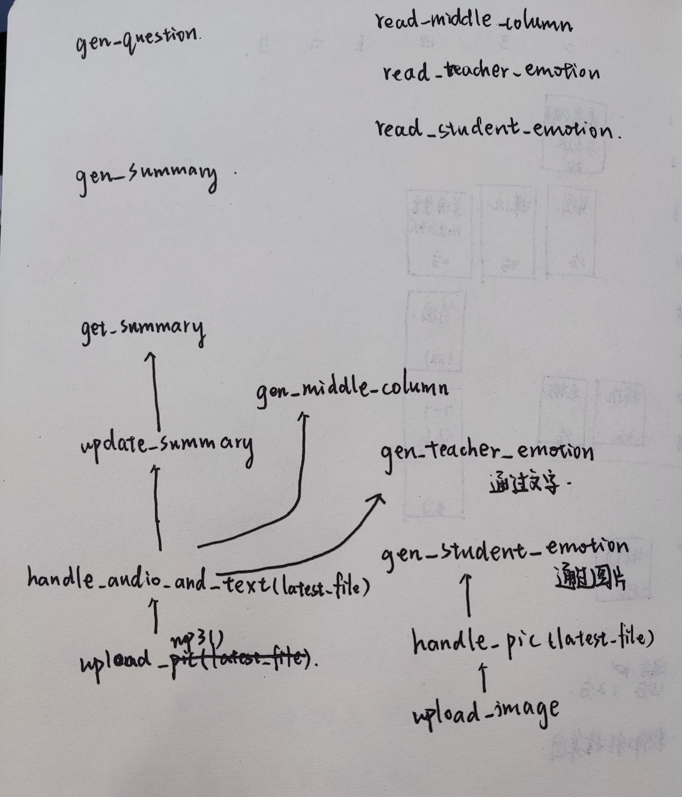

# SmartClass

是一个智能课堂软件，能够对输入音频进行处理和分析，如计算分数、生成学生和老师的情感表情等功能。同时，它还实现了一些与服务器通信的功能，例如上传音频文件、上传图片等。程序中还有一些和读写数据库相关的函数，用于存储历史评测记录和状态信息。

# 依赖

这个程序使用了Flask框架，用于搭建web应用程序。其中的依赖包解释如下：

- Flask：用于搭建web应用程序。
- request：用来处理HTTP请求。
- jsonify：用于将Python对象转换为JSON格式。
- current_app：类似于一个全局变量，可以在任何地方获取当前应用程序实例。
- os：提供许多与操作系统交互的函数。
- json：用于处理JSON数据格式。
- flask_cors：用于支持跨域资源共享。
- sqlite3：用于连接和操作SQLite数据库。
- SQLite
    
    SQLite是一种轻型的关系型数据库管理系统，采用以文件为中心的方式进行数据存储。和其他关系型数据库管理系统比如MySQL、Oracle等相比，SQLite具有占用资源少、部署简单、易于使用、开销低等优点。
    
    关系型数据库管理系统（RDBMS）是指采用关系模型来组织和管理数据的一种数据管理系统。在这种数据模型中，数据以表格的形式组织，每个表格包含多个行和列。其中每一行代表一个记录，每一列则表示一种数据类型。
    
    关系型数据库管理系统遵循ACID（原子性、一致性、隔离性和持久性）原则，确保了数据的完整性和一致性。同时，它还支持SQL（结构化查询语言），可以方便地对数据库进行增删改查等操作。
    
- datetime：用于处理日期和时间。
- time：提供各种时间相关的功能。
- myclear：自己定义的清理缓存文件的辅助函数。
- threading：用于创建和管理线程。
- multiprocessing：用于创建和管理进程。
- random：用于生成随机数。

# 函数功能

- **print_database()：**从数据库中获取数据并输出到一个日志文件中。
- **gen_middle_columm(cur_latest_audio)**：生成音频文件的中间部分的音高和静默时长等信息，并存储到数据库中。
- **compute_score(pos, neu, neg)**：根据pos, neu, neg计算出得分。
- **gen_teacher_emotion(latest_file)**：计算老师的情感得分。该函数首先获取最新的音频文件，然后计算其中文本和语音的情感得分，并结合起来计算出老师的综合情感得分。最后，将得分记录到数据库中。
- **gen_student_emotion(latest_file)**：计算学生的情感得分。该函数首先获取最新的图片文件，然后计算其中的情感得分，并记录到数据库中。
- **get_summary(history, mode="normal")**：根据给定的历史文本，生成课程总结。通过调用ChatGLM服务器的API实现。
- ChatGLM
    
    ChatGLM服务器是一个自然语言处理服务器，可以对输入的文本进行自动回复、情感分析、关键词提取等功能。它通常基于机器学习和深度学习技术实现，具有高精度和智能性等特点。ChatGLM服务器常用于个人助手、在线客服、社交媒体、搜索引擎等场景中，为用户提供自然、智能的交互体验。
    
- ChatGLM和ChatGPT有什么区别？
    
    ChatGLM和ChatGPT都是基于深度学习实现的自然语言处理模型，都具有智能、自动回复等功能。它们的主要区别如下：
    
    1. 模型架构不同：ChatGLM采用了LSTM、GRU等循环神经网络结构来建模，而ChatGPT则采用了Transformer结构。
    2. 数据集来源不同：ChatGLM的训练数据主要是从多个开源数据集中抽取的对话文本，而ChatGPT的训练数据则主要来自于网站上公开的大型文本语料库，例如维基百科等。
    3. 应用场景不同：由于ChatGLM较适合处理短文本任务，所以主要应用场景为在线客服、聊天机器人等需要快速、准确回答用户提问的场景；而ChatGPT适合处理长文本任务，更多应用于文本生成、语音识别等需要处理复杂语义结构的场景。
    
    总的来说，ChatGLM主要是针对短文本问答任务的深度学习模型，而ChatGPT则主要用于文本生成和处理长文本任务
    
- **update_summary()**：更新课程总结。该函数从数据库中获取历史文本和当前课程总结，将历史文本按200个字一段进行分割，然后调用get_summary函数生成对应的每一段的总结。最后将结果存储到数据库中。如果课程总结超过了200个字，则会进行精简，保证不超过200个字。
- **handle_audio_and_text(latest_file)**：处理最新上传的音频文件。该函数调用gen_middle_columm、gen_teacher_emotion和update_summary函数，更新当前课程状态，并将结果记录到数据库中。
- **handle_pic(latest_file)**：处理最新上传的图片文件。该函数调用gen_student_emotion函数，更新当前课程状态，并将结果记录到数据库中。
- **upload_mp3()**：接收上传的mp3文件，将其转换为wav格式，然后调用handle_audio_and_text函数处理最新的音频文件。
- **upload_image()**：接收上传的图片文件，然后调用handle_pic函数处理最新的图片文件。
- **gen_question()**：生成问题。该函数从数据库中获取当前课程总结，然后构造数据格式向ChatGLM服务器发送POST请求，请求对当前摘要进行分析，生成三个问题。最后将结果返回给客户端。
- **gen_summary()**：生成课程总结。该函数从数据库中获取当前课程总结，然后构造数据格式向ChatGLM服务器发送POST请求，请求对当前摘要进行分析，生成100字以内的课程总结。最后将结果返回给客户端。
- **read_middle_columm()**：读取中间栏。该函数从数据库中获取当前课程的语速和音频静默值，并将其返回给客户端。
- **read_teacher_emotion()**：读取老师情感得分。该函数从数据库中获取当前课程的老师情感得分，并将其返回给客户端。
- **read_student_emotion()**：读取学生情感得分。该函数从数据库中获取当前课程的学生情感得分，并将其返回给客户端。

# 函数关系

